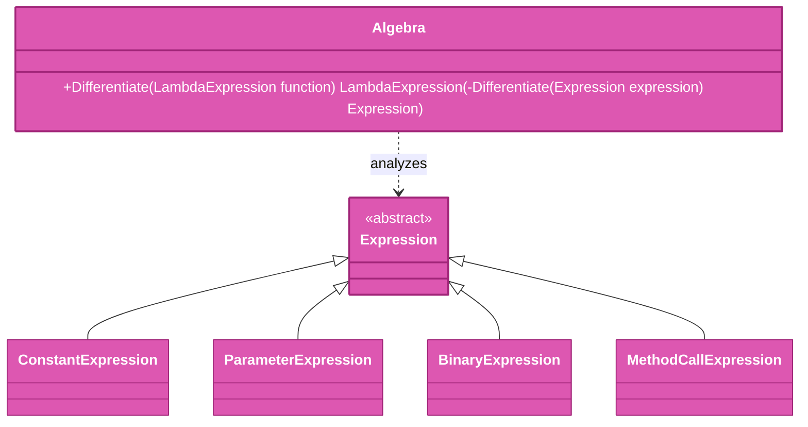

```mermaid
classDiagram
    direction TB

    class Algebra {
        +Differentiate(LambdaExpression function) LambdaExpression\(-Differentiate(Expression expression) Expression\)
    }

    class Expression {
        <<abstract>>
    }

    class ConstantExpression {
    }

    class ParameterExpression {
    }

    class BinaryExpression {
    }

    class MethodCallExpression {
    }

    Expression <|-- ConstantExpression
    Expression <|-- ParameterExpression
    Expression <|-- BinaryExpression
    Expression <|-- MethodCallExpression

    Algebra ..> Expression : analyzes

    style Algebra fill:#dd57b1,stroke:#a12679,stroke-width:2px,color:#fff
    style Expression fill:#dd57b1,stroke:#a12679,stroke-width:2px,color:#fff
    style ConstantExpression fill:#dd57b1,stroke:#a12679,stroke-width:1px,color:#fff
    style ParameterExpression fill:#dd57b1,stroke:#a12679,stroke-width:1px,color:#fff
    style BinaryExpression fill:#dd57b1,stroke:#a12679,stroke-width:1px,color:#fff
    style MethodCallExpression fill:#dd57b1,stroke:#a12679,stroke-width:1px,color:#fff
```
