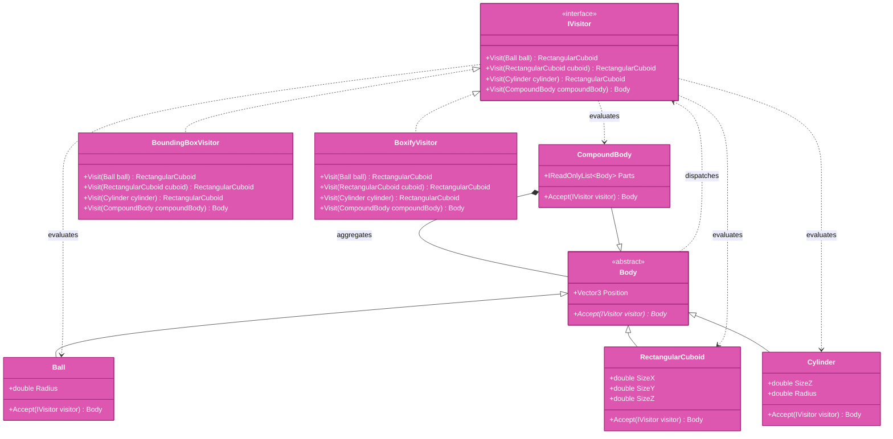

```mermaid
classDiagram
    direction TB

    class IVisitor {
        <<interface>>
        +Visit(Ball ball) RectangularCuboid
        +Visit(RectangularCuboid cuboid) RectangularCuboid
        +Visit(Cylinder cylinder) RectangularCuboid
        +Visit(CompoundBody compoundBody) Body
    }

    class Body {
        <<abstract>>
        +Vector3 Position
        +Accept(IVisitor visitor)* Body
    }

    class Ball {
        +double Radius
        +Accept(IVisitor visitor) Body
    }

    class RectangularCuboid {
        +double SizeX
        +double SizeY
        +double SizeZ
        +Accept(IVisitor visitor) Body
    }

    class Cylinder {
        +double SizeZ
        +double Radius
        +Accept(IVisitor visitor) Body
    }

    class CompoundBody {
        +IReadOnlyList~Body~ Parts
        +Accept(IVisitor visitor) Body
    }

    class BoundingBoxVisitor {
        +Visit(Ball ball) RectangularCuboid
        +Visit(RectangularCuboid cuboid) RectangularCuboid
        +Visit(Cylinder cylinder) RectangularCuboid
        +Visit(CompoundBody compoundBody) Body
    }

    class BoxifyVisitor {
        +Visit(Ball ball) RectangularCuboid
        +Visit(RectangularCuboid cuboid) RectangularCuboid
        +Visit(Cylinder cylinder) RectangularCuboid
        +Visit(CompoundBody compoundBody) Body
    }

    Body <|-- Ball
    Body <|-- RectangularCuboid
    Body <|-- Cylinder
    Body <|-- CompoundBody

    CompoundBody *-- Body : aggregates

    IVisitor <|.. BoundingBoxVisitor
    IVisitor <|.. BoxifyVisitor

    Body ..> IVisitor : dispatches
    IVisitor ..> Ball : evaluates
    IVisitor ..> RectangularCuboid : evaluates
    IVisitor ..> Cylinder : evaluates
    IVisitor ..> CompoundBody : evaluates

    style IVisitor fill:#dd57b1,stroke:#a12679,stroke-width:2px,color:#fff
    style Body fill:#dd57b1,stroke:#a12679,stroke-width:2px,color:#fff
    style Ball fill:#dd57b1,stroke:#a12679,stroke-width:1px,color:#fff
    style RectangularCuboid fill:#dd57b1,stroke:#a12679,stroke-width:1px,color:#fff
    style Cylinder fill:#dd57b1,stroke:#a12679,stroke-width:1px,color:#fff
    style CompoundBody fill:#dd57b1,stroke:#a12679,stroke-width:1px,color:#fff
    style BoundingBoxVisitor fill:#dd57b1,stroke:#a12679,stroke-width:1px,color:#fff
    style BoxifyVisitor fill:#dd57b1,stroke:#a12679,stroke-width:1px,color:#fff
```
