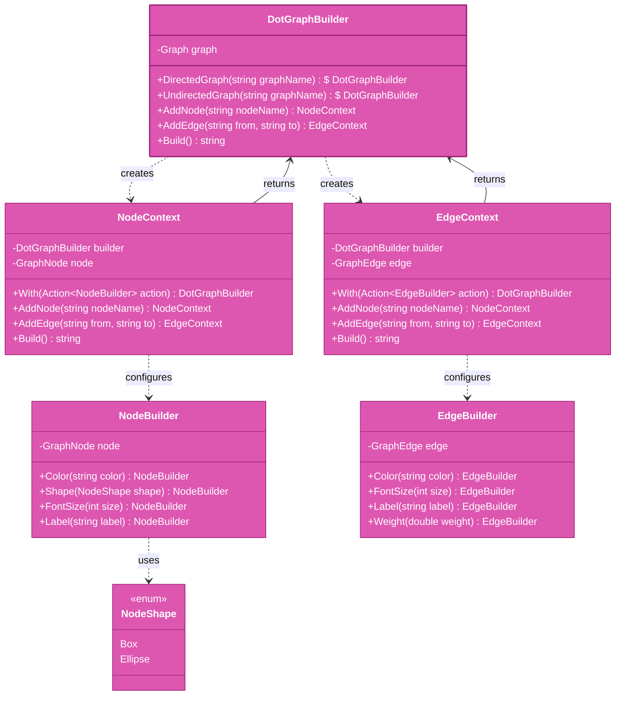

```mermaid
classDiagram
    direction TB

    class NodeShape {
        <<enum>>
        Box
        Ellipse
    }

    class DotGraphBuilder {
        -Graph graph
        +DirectedGraph(string graphName)\$ DotGraphBuilder
        +UndirectedGraph(string graphName)\$ DotGraphBuilder
        +AddNode(string nodeName) NodeContext
        +AddEdge(string from, string to) EdgeContext
        +Build() string
    }

    class NodeContext {
        -DotGraphBuilder builder
        -GraphNode node
        +With(Action~NodeBuilder~ action) DotGraphBuilder
        +AddNode(string nodeName) NodeContext
        +AddEdge(string from, string to) EdgeContext
        +Build() string
    }

    class EdgeContext {
        -DotGraphBuilder builder
        -GraphEdge edge
        +With(Action~EdgeBuilder~ action) DotGraphBuilder
        +AddNode(string nodeName) NodeContext
        +AddEdge(string from, string to) EdgeContext
        +Build() string
    }

    class NodeBuilder {
        -GraphNode node
        +Color(string color) NodeBuilder
        +Shape(NodeShape shape) NodeBuilder
        +FontSize(int size) NodeBuilder
        +Label(string label) NodeBuilder
    }

    class EdgeBuilder {
        -GraphEdge edge
        +Color(string color) EdgeBuilder
        +FontSize(int size) EdgeBuilder
        +Label(string label) EdgeBuilder
        +Weight(double weight) EdgeBuilder
    }

    DotGraphBuilder ..> NodeContext : creates
    DotGraphBuilder ..> EdgeContext : creates
    NodeContext ..> NodeBuilder : configures
    NodeContext --> DotGraphBuilder : returns
    EdgeContext ..> EdgeBuilder : configures
    EdgeContext --> DotGraphBuilder : returns
    NodeBuilder ..> NodeShape : uses

    style NodeShape fill:#dd57b1,stroke:#a12679,stroke-width:1px,color:#fff
    style DotGraphBuilder fill:#dd57b1,stroke:#a12679,stroke-width:2px,color:#fff
    style NodeContext fill:#dd57b1,stroke:#a12679,stroke-width:1px,color:#fff
    style EdgeContext fill:#dd57b1,stroke:#a12679,stroke-width:1px,color:#fff
    style NodeBuilder fill:#dd57b1,stroke:#a12679,stroke-width:1px,color:#fff
    style EdgeBuilder fill:#dd57b1,stroke:#a12679,stroke-width:1px,color:#fff
```
