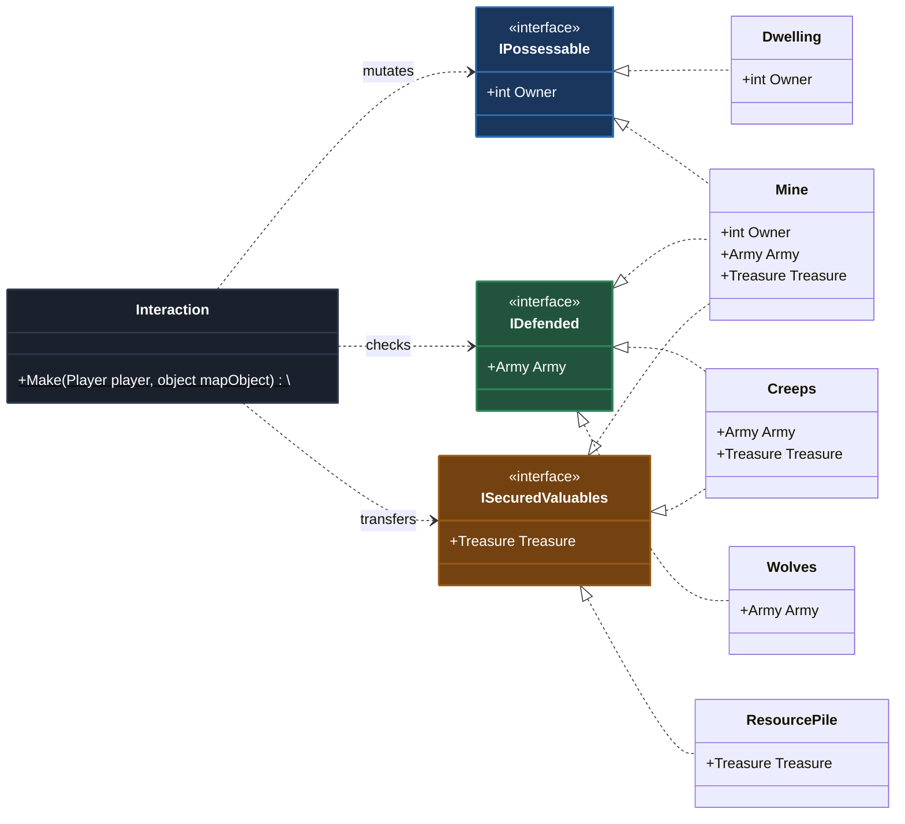

```mermaid
classDiagram
    direction LR

    class IPossessable {
        <<interface>>
        +int Owner
    }

    class IDefended {
        <<interface>>
        +Army Army
    }

    class ISecuredValuables {
        <<interface>>
        +Treasure Treasure
    }

    class Dwelling {
        +int Owner
    }

    class Mine {
        +int Owner
        +Army Army
        +Treasure Treasure
    }

    class Creeps {
        +Army Army
        +Treasure Treasure
    }

    class Wolves {
        +Army Army
    }

    class ResourcePile {
        +Treasure Treasure
    }

    class Interaction {
        +Make(Player player, object mapObject)\$
    }

    IPossessable <|.. Dwelling
    IPossessable <|.. Mine
    IDefended <|.. Mine
    IDefended <|.. Creeps
    IDefended <|.. Wolves
    ISecuredValuables <|.. Mine
    ISecuredValuables <|.. Creeps
    ISecuredValuables <|.. ResourcePile

    Interaction ..> IPossessable : mutates
    Interaction ..> IDefended : checks
    Interaction ..> ISecuredValuables : transfers

    style Interaction fill:#1a202c,stroke:#2d3748,stroke-width:2px,color:#fff
    style IPossessable fill:#1a365d,stroke:#2b6cb0,stroke-width:2px,color:#fff
    style IDefended fill:#22543d,stroke:#2f855a,stroke-width:2px,color:#fff
    style ISecuredValuables fill:#744210,stroke:#975a16,stroke-width:2px,color:#fff
```
