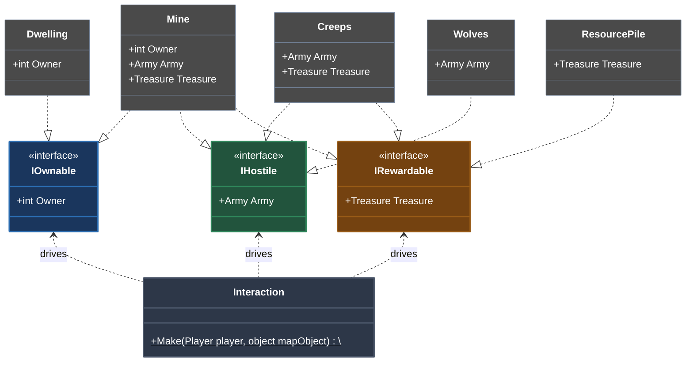

```mermaid
classDiagram
    direction BT

    class IOwnable {
        <<interface>>
        +int Owner
    }

    class IHostile {
        <<interface>>
        +Army Army
    }

    class IRewardable {
        <<interface>>
        +Treasure Treasure
    }

    class Dwelling {
        +int Owner
    }

    class Mine {
        +int Owner
        +Army Army
        +Treasure Treasure
    }

    class Creeps {
        +Army Army
        +Treasure Treasure
    }

    class Wolves {
        +Army Army
    }

    class ResourcePile {
        +Treasure Treasure
    }

    class Interaction {
        +Make(Player player, object mapObject)\$
    }

    IOwnable <|.. Dwelling
    IOwnable <|.. Mine
    IHostile <|.. Mine
    IRewardable <|.. Mine
    IHostile <|.. Creeps
    IRewardable <|.. Creeps
    IHostile <|.. Wolves
    IRewardable <|.. ResourcePile

    Interaction ..> IOwnable : drives
    Interaction ..> IHostile : drives
    Interaction ..> IRewardable : drives

    style Interaction fill:#2d3748,stroke:#4a5568,stroke-width:2px,color:#fff
    style IOwnable fill:#1a365d,stroke:#2b6cb0,stroke-width:2px,color:#fff
    style IHostile fill:#22543d,stroke:#2f855a,stroke-width:2px,color:#fff
    style IRewardable fill:#744210,stroke:#975a16,stroke-width:2px,color:#fff
    style Dwelling fill:#4a4a4a,stroke:#718096,stroke-width:1px,color:#fff
    style Mine fill:#4a4a4a,stroke:#718096,stroke-width:1px,color:#fff
    style Creeps fill:#4a4a4a,stroke:#718096,stroke-width:1px,color:#fff
    style Wolves fill:#4a4a4a,stroke:#718096,stroke-width:1px,color:#fff
    style ResourcePile fill:#4a4a4a,stroke:#718096,stroke-width:1px,color:#fff
```
