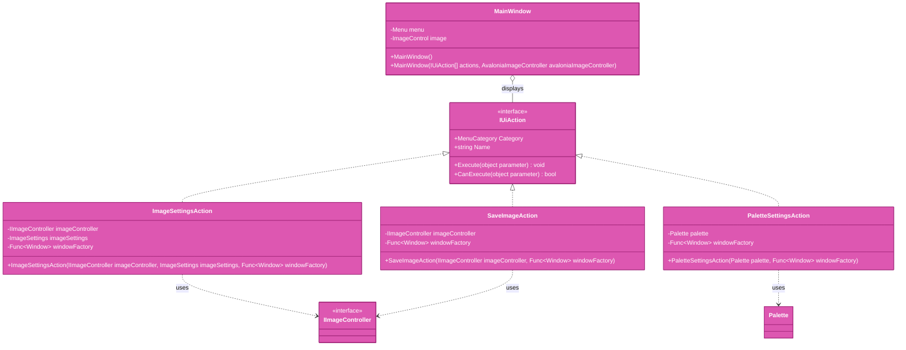

```mermaid
classDiagram
    direction TB

    class IUiAction {
        <<interface>>
        +MenuCategory Category
        +string Name
        +Execute(object parameter) void
        +CanExecute(object parameter) bool
    }

    class IImageController {
        <<interface>>
    }

    class Palette {
    }

    class ImageSettingsAction {
        -IImageController imageController
        -ImageSettings imageSettings
        -Func~Window~ windowFactory
        +ImageSettingsAction(IImageController imageController, ImageSettings imageSettings, Func~Window~ windowFactory)
    }

    class SaveImageAction {
        -IImageController imageController
        -Func~Window~ windowFactory
        +SaveImageAction(IImageController imageController, Func~Window~ windowFactory)
    }

    class PaletteSettingsAction {
        -Palette palette
        -Func~Window~ windowFactory
        +PaletteSettingsAction(Palette palette, Func~Window~ windowFactory)
    }

    class MainWindow {
        -Menu menu
        -ImageControl image
        +MainWindow()
        +MainWindow(IUiAction[] actions, AvaloniaImageController avaloniaImageController)
    }

    IUiAction <|.. ImageSettingsAction
    IUiAction <|.. SaveImageAction
    IUiAction <|.. PaletteSettingsAction

    MainWindow o-- IUiAction : displays
    ImageSettingsAction ..> IImageController : uses
    SaveImageAction ..> IImageController : uses
    PaletteSettingsAction ..> Palette : uses

    style IUiAction fill:#dd57b1,stroke:#a12679,stroke-width:2px,color:#fff
    style IImageController fill:#dd57b1,stroke:#a12679,stroke-width:2px,color:#fff
    style Palette fill:#dd57b1,stroke:#a12679,stroke-width:1px,color:#fff
    style ImageSettingsAction fill:#dd57b1,stroke:#a12679,stroke-width:1px,color:#fff
    style SaveImageAction fill:#dd57b1,stroke:#a12679,stroke-width:1px,color:#fff
    style PaletteSettingsAction fill:#dd57b1,stroke:#a12679,stroke-width:1px,color:#fff
    style MainWindow fill:#dd57b1,stroke:#a12679,stroke-width:2px,color:#fff
```
