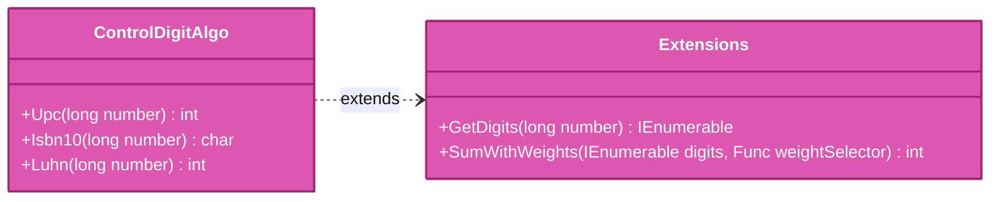

```mermaid
classDiagram
    direction LR

    class Extensions {
        +GetDigits(long number) IEnumerable
        +SumWithWeights(IEnumerable digits, Func weightSelector) int
    }

    class ControlDigitAlgo {
        +Upc(long number) int
        +Isbn10(long number) char
        +Luhn(long number) int
    }

    ControlDigitAlgo ..> Extensions : extends

    style Extensions fill:#dd57b1,stroke:#a12679,stroke-width:2px,color:#fff
    style ControlDigitAlgo fill:#dd57b1,stroke:#a12679,stroke-width:2px,color:#fff
```
