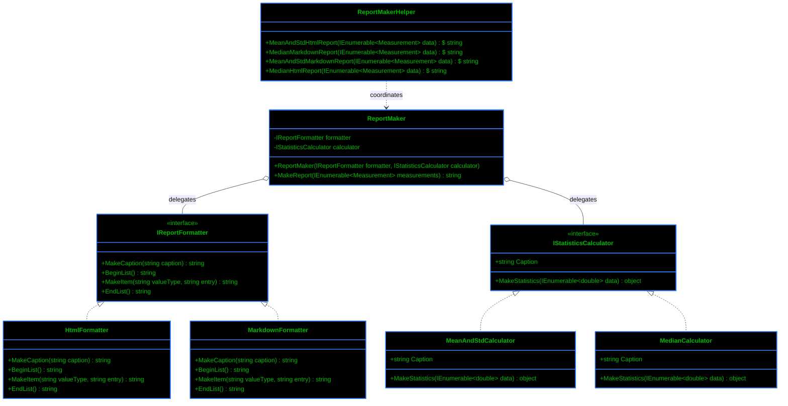

```mermaid
classDiagram
    direction TB

    class IReportFormatter {
        <<interface>>
        +MakeCaption(string caption) string
        +BeginList() string
        +MakeItem(string valueType, string entry) string
        +EndList() string
    }

    class IStatisticsCalculator {
        <<interface>>
        +string Caption
        +MakeStatistics(IEnumerable~double~ data) object
    }

    class HtmlFormatter {
        +MakeCaption(string caption) string
        +BeginList() string
        +MakeItem(string valueType, string entry) string
        +EndList() string
    }

    class MarkdownFormatter {
        +MakeCaption(string caption) string
        +BeginList() string
        +MakeItem(string valueType, string entry) string
        +EndList() string
    }

    class MeanAndStdCalculator {
        +string Caption
        +MakeStatistics(IEnumerable~double~ data) object
    }

    class MedianCalculator {
        +string Caption
        +MakeStatistics(IEnumerable~double~ data) object
    }

    class ReportMaker {
        -IReportFormatter formatter
        -IStatisticsCalculator calculator
        +ReportMaker(IReportFormatter formatter, IStatisticsCalculator calculator)
        +MakeReport(IEnumerable~Measurement~ measurements) string
    }

    class ReportMakerHelper {
        +MeanAndStdHtmlReport(IEnumerable~Measurement~ data)\$ string
        +MedianMarkdownReport(IEnumerable~Measurement~ data)\$ string
        +MeanAndStdMarkdownReport(IEnumerable~Measurement~ data)\$ string
        +MedianHtmlReport(IEnumerable~Measurement~ data)\$ string
    }

    IReportFormatter <|.. HtmlFormatter
    IReportFormatter <|.. MarkdownFormatter
    IStatisticsCalculator <|.. MeanAndStdCalculator
    IStatisticsCalculator <|.. MedianCalculator

    ReportMaker o-- IReportFormatter : delegates
    ReportMaker o-- IStatisticsCalculator : delegates
    ReportMakerHelper ..> ReportMaker : coordinates

    style ReportMaker fill:#000001,stroke:#3581ff,stroke-width:2px,color:#00b701
    style ReportMakerHelper fill:#000001,stroke:#3581ff,stroke-width:2px,color:#00b701

    style IReportFormatter fill:#000001,stroke:#3581ff,stroke-width:2px,color:#00b701
    style IStatisticsCalculator fill:#000001,stroke:#3581ff,stroke-width:2px,color:#00b701
    style HtmlFormatter fill:#000001,stroke:#3581ff,stroke-width:2px,color:#00b701
    style MarkdownFormatter fill:#000001,stroke:#3581ff,stroke-width:2px,color:#00b701
    style MeanAndStdCalculator fill:#000001,stroke:#3581ff,stroke-width:2px,color:#00b701
    style MedianCalculator fill:#000001,stroke:#3581ff,stroke-width:2px,color:#00b701
```
