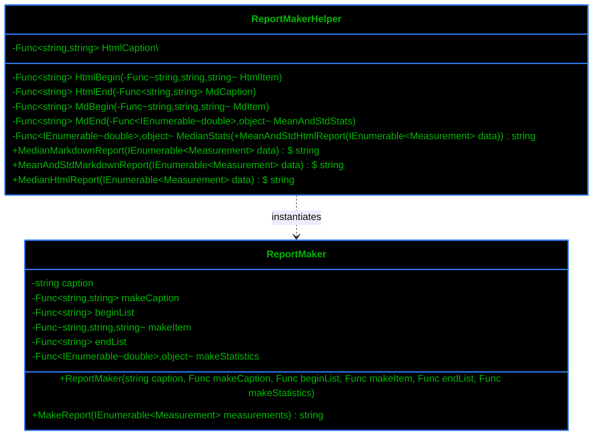

```mermaid
classDiagram
    direction TB

    class ReportMaker {
        -string caption
        -Func~string,string~ makeCaption
        -Func~string~ beginList
        -Func~string,string,string~ makeItem
        -Func~string~ endList
        -Func~IEnumerable~double~,object~ makeStatistics
        +ReportMaker(string caption, Func makeCaption, Func beginList, Func makeItem, Func endList, Func makeStatistics)
        +MakeReport(IEnumerable~Measurement~ measurements) string
    }

    class ReportMakerHelper {
        -Func~string,string~ HtmlCaption\$
        -Func~string~ HtmlBegin\(-Func~string,string,string~ HtmlItem\)
        -Func~string~ HtmlEnd\(-Func~string,string~ MdCaption\)
        -Func~string~ MdBegin\(-Func~string,string,string~ MdItem\)
        -Func~string~ MdEnd\(-Func~IEnumerable~double~,object~ MeanAndStdStats\)
        -Func~IEnumerable~double~,object~ MedianStats\(+MeanAndStdHtmlReport(IEnumerable~Measurement~ data)\) string
        +MedianMarkdownReport(IEnumerable~Measurement~ data)\$ string
        +MeanAndStdMarkdownReport(IEnumerable~Measurement~ data)\$ string
        +MedianHtmlReport(IEnumerable~Measurement~ data)\$ string
    }

    ReportMakerHelper ..> ReportMaker : instantiates

    style ReportMaker fill:#000001,stroke:#3581ff,stroke-width:2px,color:#00b701
    style ReportMakerHelper fill:#000001,stroke:#3581ff,stroke-width:2px,color:#00b701
```
