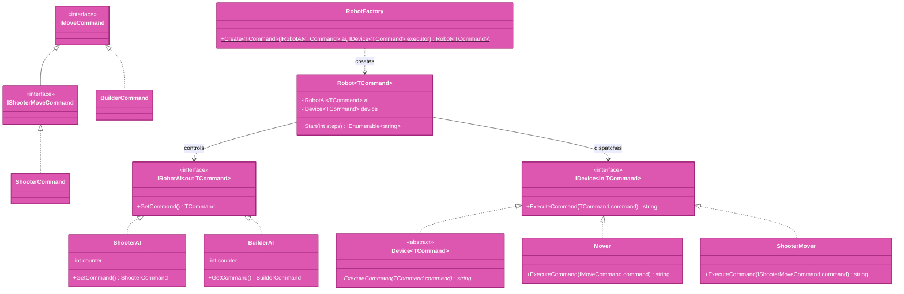

```mermaid
classDiagram
    direction TB

    class IMoveCommand {
        <<interface>>
    }

    class IShooterMoveCommand {
        <<interface>>
    }

    class ShooterCommand {
    }

    class BuilderCommand {
    }

    class IRobotAI~out TCommand~ {
        <<interface>>
        +GetCommand() TCommand
    }

    class IDevice~in TCommand~ {
        <<interface>>
        +ExecuteCommand(TCommand command) string
    }

    class Device~TCommand~ {
        <<abstract>>
        +ExecuteCommand(TCommand command)* string
    }

    class ShooterAI {
        -int counter
        +GetCommand() ShooterCommand
    }

    class BuilderAI {
        -int counter
        +GetCommand() BuilderCommand
    }

    class Mover {
        +ExecuteCommand(IMoveCommand command) string
    }

    class ShooterMover {
        +ExecuteCommand(IShooterMoveCommand command) string
    }

    class Robot~TCommand~ {
        -IRobotAI~TCommand~ ai
        -IDevice~TCommand~ device
        +Start(int steps) IEnumerable~string~
    }

    class RobotFactory {
        +Create~TCommand~(IRobotAI~TCommand~ ai, IDevice~TCommand~ executor) Robot~TCommand~\$
    }

    IMoveCommand <|-- IShooterMoveCommand
    IMoveCommand <|.. BuilderCommand
    IShooterMoveCommand <|.. ShooterCommand

    IRobotAI <|.. ShooterAI
    IRobotAI <|.. BuilderAI
    
    IDevice <|.. Device
    IDevice <|.. Mover
    IDevice <|.. ShooterMover

    Robot --> IRobotAI : controls
    Robot --> IDevice : dispatches
    RobotFactory ..> Robot : creates

    style IMoveCommand fill:#dd57b1,stroke:#a12679,stroke-width:2px,color:#fff
    style IShooterMoveCommand fill:#dd57b1,stroke:#a12679,stroke-width:2px,color:#fff
    style ShooterCommand fill:#dd57b1,stroke:#a12679,stroke-width:1px,color:#fff
    style BuilderCommand fill:#dd57b1,stroke:#a12679,stroke-width:1px,color:#fff
    style IRobotAI fill:#dd57b1,stroke:#a12679,stroke-width:2px,color:#fff
    style IDevice fill:#dd57b1,stroke:#a12679,stroke-width:2px,color:#fff
    style Device fill:#dd57b1,stroke:#a12679,stroke-width:2px,color:#fff
    style ShooterAI fill:#dd57b1,stroke:#a12679,stroke-width:1px,color:#fff
    style BuilderAI fill:#dd57b1,stroke:#a12679,stroke-width:1px,color:#fff
    style Mover fill:#dd57b1,stroke:#a12679,stroke-width:1px,color:#fff
    style ShooterMover fill:#dd57b1,stroke:#a12679,stroke-width:1px,color:#fff
    style Robot fill:#dd57b1,stroke:#a12679,stroke-width:2px,color:#fff
    style RobotFactory fill:#dd57b1,stroke:#a12679,stroke-width:1px,color:#fff
```
