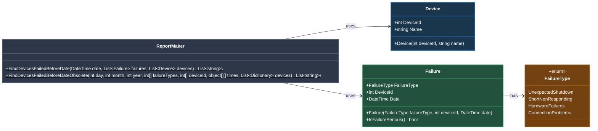

```mermaid
classDiagram
    direction LR
    
    class FailureType {
        <<enum>>
        UnexpectedShutdown
        ShortNonResponding
        HardwareFailures
        ConnectionProblems
    }

    class Device {
        +int DeviceId
        +string Name
        +Device(int deviceId, string name)
    }

    class Failure {
        +FailureType FailureType
        +int DeviceId
        +DateTime Date
        +Failure(FailureType failureType, int deviceId, DateTime date)
        +IsFailureSerious() bool
    }

    class ReportMaker {
        +FindDevicesFailedBeforeDate(DateTime date, List~Failure~ failures, List~Device~ devices) List~string~\$
        +FindDevicesFailedBeforeDateObsolete(int day, int month, int year, int[] failureTypes, int[] deviceId, object[][] times, List~Dictionary~ devices) List~string~\$
    }

    Failure --> FailureType : has
    ReportMaker --> Device : uses
    ReportMaker --> Failure : uses

    style ReportMaker fill:#2d3747,stroke:#4a5568,stroke-width:2px,color:#fff
    style Device fill:#1a364d,stroke:#2b6cb0,stroke-width:2px,color:#fff
    style Failure fill:#22523d,stroke:#2f855a,stroke-width:2px,color:#fff
    style FailureType fill:#744110,stroke:#975a16,stroke-width:2px,color:#fff
```
