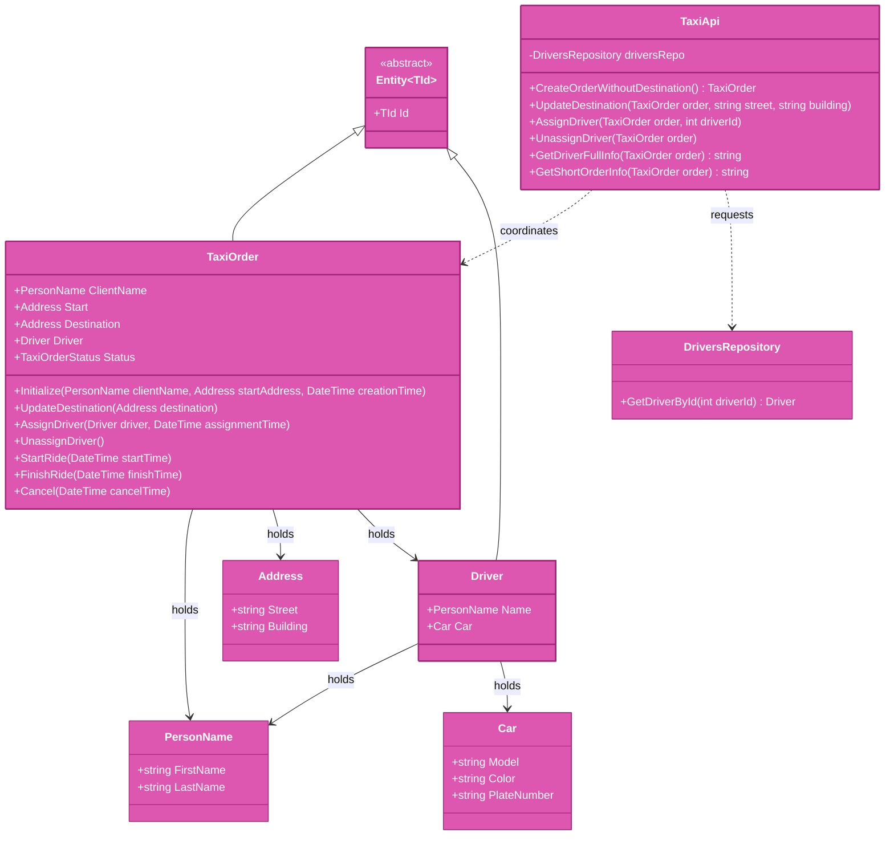

```mermaid
classDiagram
    direction TB

    class Entity~TId~ {
        <<abstract>>
        +TId Id
    }

    class PersonName {
        +string FirstName
        +string LastName
    }

    class Address {
        +string Street
        +string Building
    }

    class Car {
        +string Model
        +string Color
        +string PlateNumber
    }

    class Driver {
        +PersonName Name
        +Car Car
    }

    class TaxiOrder {
        +PersonName ClientName
        +Address Start
        +Address Destination
        +Driver Driver
        +TaxiOrderStatus Status
        +Initialize(PersonName clientName, Address startAddress, DateTime creationTime)
        +UpdateDestination(Address destination)
        +AssignDriver(Driver driver, DateTime assignmentTime)
        +UnassignDriver()
        +StartRide(DateTime startTime)
        +FinishRide(DateTime finishTime)
        +Cancel(DateTime cancelTime)
    }

    class DriversRepository {
        +GetDriverById(int driverId) Driver
    }

    class TaxiApi {
        -DriversRepository driversRepo
        +CreateOrderWithoutDestination() TaxiOrder
        +UpdateDestination(TaxiOrder order, string street, string building)
        +AssignDriver(TaxiOrder order, int driverId)
        +UnassignDriver(TaxiOrder order)
        +GetDriverFullInfo(TaxiOrder order) string
        +GetShortOrderInfo(TaxiOrder order) string
    }

    Entity <|-- TaxiOrder
    Entity <|-- Driver
    TaxiOrder --> PersonName : holds
    TaxiOrder --> Address : holds
    TaxiOrder --> Driver : holds
    Driver --> PersonName : holds
    Driver --> Car : holds

    TaxiApi ..> TaxiOrder : coordinates
    TaxiApi ..> DriversRepository : requests

    style Entity fill:#dd57b1,stroke:#a12679,stroke-width:2px,color:#fff
    style PersonName fill:#dd57b1,stroke:#a12679,stroke-width:1px,color:#fff
    style Address fill:#dd57b1,stroke:#a12679,stroke-width:1px,color:#fff
    style Car fill:#dd57b1,stroke:#a12679,stroke-width:1px,color:#fff
    style Driver fill:#dd57b1,stroke:#a12679,stroke-width:2px,color:#fff
    style TaxiOrder fill:#dd57b1,stroke:#a12679,stroke-width:2px,color:#fff
    style DriversRepository fill:#dd57b1,stroke:#a12679,stroke-width:1px,color:#fff
    style TaxiApi fill:#dd57b1,stroke:#a12679,stroke-width:2px,color:#fff
```
